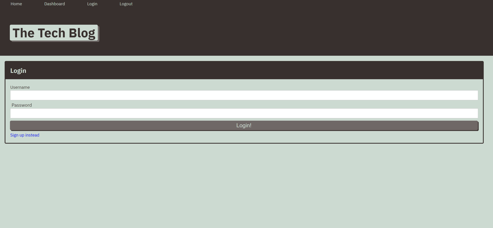

## Tech Blog

## Description

Created a CMS style tech blog application using node.js, bcrypt, connect-session-sequelize, express, express-handlebars, express-session, mysql2, and sequelize.

## Table of Contents

* [Usage](#Usage)
* [License](#License)
* [Questions](#Questions)
* [Acknowledgements](#Acknowledgements)
* [Screenshots](#Screenshots)

## Usage

Follow [https://migs-tech-blog.herokuapp.com/], create your own user name/password and login.

## License

MIT

## Questions

For additional information please contact me via GitHub at [https://github.com/malicea0783](https://github.com/malicea0783) or via email at [malicea0783@gmail.com](mailto:malicea0783@gamil.com?subject=[GitHub]%Tech%Blog).

## Acknowledgements

Worked on this with the entire class.

## Screenshots

